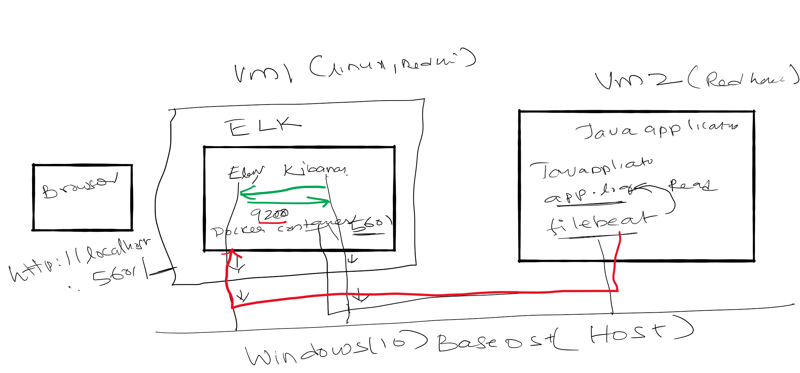

# Monitor Springboot Java application logs with ELK
In this tutorial we are going to monitor logs of a Java application that is based on Springboot using ELK. Java application writes logs to file system, using filebeat plugin this logs are send to Elastic Search Server to a defined Index. Using Kibana we are going to Query the index and fetch log messages.

Note: No Logstash components is used in this flow

We will
- Run Elastic Search and Kibana in a docker container
- Run Java application that produces log messages to file
- Configure filebeat plugin to read log messages from the file and publish it to Elastic Search Index
- Use Kibana to view or query the logs
# Code
    git clone https://github.com/balajich/monitor-springboot-logs-with-elk.git
# Prerequisite
- Docker Compose
- Vagrant (optional)
- Java
# Video

# Architecture

# Bootstrap environment
We will be using vagrant to bring two machines up
- elkserver (Linux machine that runs elk in a docker container)
- sbclient (Linux machine that runs  Springboot java application and filebeat client) 

## Bring two virtual machines up ,installs docker-compose and setup network    
        
        vagrant up
The virutal machine configuration, network and necessary installation is defined in Vagrantfile
## Server- ELK in docker container

Take ssh to elkserver
Increase vm.max_map_count 
### On Windows
    open powershell
    wsl -d docker-desktop
    sysctl -w vm.max_map_count=262144

## On Linux
    sudo sysctl -w vm.max_map_count=262144
    sysctl -a | grep max_map_count
## Start ELK on Docker
    # Run elk in detached mode in docker
    docker-compose up -d

# Client- Springboot application and filebeat plugin

- Run Spring boot Java application that writes logs to file app.log
- Run filebeat client that reads log messages in log file (app.log) and send to Elastic Search Server

        Build Java application
        $cd /vagrant/springbootapp
        $mvn clean install
        Run Jar file and write log message to app.log
        $cd target
        $ java -jar springbootapp-0.0.1-SNAPSHOT.jar > app.log
        #Run file beat program
        $ cp filebeat.yml /etc/filebeat
        $filebeat run
    

# Access  Kibana UI
http://localhost:5601/

# References
- https://github.com/spring-guides/gs-rest-service
